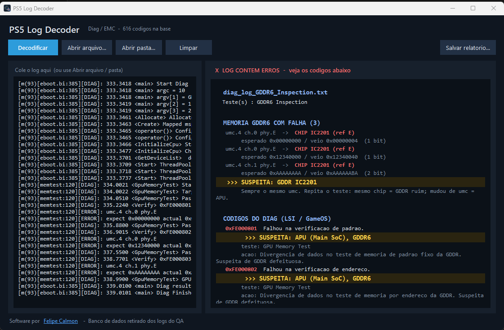

# PS5 Log Decoder

Ferramenta de bancada que lê o log de diagnóstico do PlayStation 5 e traduz, em
português, o que ele está dizendo — transformando as linhas técnicas do Diag/EMC
em um laudo direto: **o que falhou, qual peça é suspeita e o próximo passo.**

> Feito para assistência técnica. Não precisa de internet, não fala com o console
> e não tem nada de autenticação — é apenas um tradutor de log.

---

## ⬇️ Download

Baixe o programa pronto na aba **[Releases](../../releases/latest)** →
`PS5 Log Decoder.exe`. É só baixar e abrir (Windows, sem instalar nada).

---

## Recursos

- **Tudo em português.** As mensagens e os procedimentos saem traduzidos, mantendo
  as siglas técnicas (CRC, GDDR, NAND, PCIe) e os nomes de teste. A **suspeita fica
  em destaque**, fácil de bater o olho.
- **Base com mais de 600 códigos**, extraídos das próprias tabelas de diagnóstico do
  QA (ErrorCodeTable, DiagSummary e EMC Error Code), já com a peça/área suspeita.
- **Identifica a memória GDDR com defeito.** Ao encontrar `umc.N` no log, mostra o
  chip físico exato (ex.: `IC2201 / ref E`) e aplica a regra oficial:
  mesmo `umc` sempre = GDDR ruim; `umc` variando = APU.
- **Identifica a NAND do SSD interno.** Lê o status por canal
  (`ch0 … ch11`) e aponta o chip NAND (ex.: `CH5 → IC4203 / CE0`).
- **Núcleos de CPU.** No teste de carga, mostra qual(is) CPU falharam (ex.: CPU2, CPU3).
- **Separa memória × APU.** Cruza quais testes passaram para apontar se o problema
  é a RAM/SSD ou o processador (APU / Main SoC).
- **Mostra a temperatura** registrada no EMC (SoC e ambiente), destacando
  superaquecimento em vermelho.
- **Lê dois tipos de log:** o do **Diag / LSI Inspection** (gravado no pendrive)
  e o **EMC Error Log**.
- **Filtra ruído:** ignora valores de dado (`expect/actual`, CRC, endereços, handles)
  que não são códigos de erro.

## Como usar

1. Abra o `PS5 Log Decoder.exe`.
2. Cole o log na caixa, ou use **Abrir arquivo** / **Abrir pasta** (lê o pendrive inteiro).
3. O laudo aparece na hora, com o veredito no topo:
   - 🔴 contém erros  🟢 passou (PASS/Finished)  🟡 log parcial

## Requisitos

- Windows. **Não precisa instalar nada** e **não precisa de internet** — a base de
  códigos vem embutida no executável.

## De onde vêm os dados

Todos os códigos e descrições são extraídos dos documentos oficiais de reparo
(tabelas de erro do QA). As traduções de área/subsistema e a regra de decisão
memória×APU seguem o que esses documentos descrevem.

## Observações

- O log precisa chegar até o ponto da falha: se o console não sobe o Diag, não há log.
- O detalhe da memória (`umc.N`) só aparece quando um teste de GDDR falha de fato.
- A tela do QA mostra só pass/fail; quem aponta o componente é o **log**.

---

*Software por Felipe Calmon — Banco de dados retirado dos logs do QA.*
